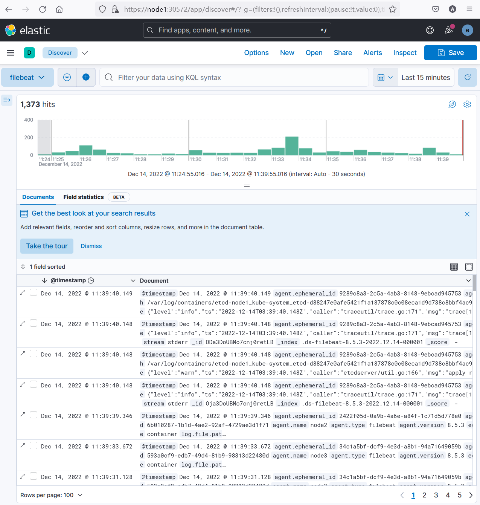

# 使用Operator部署Elastic技术堆栈

## 在群集上部署EKC

安装CRD 

```bash
kubectl create -f https://download.elastic.co/downloads/eck/2.5.0/crds.yaml
```


检查CRD

```bash
 kubectl get crd | grep elastic
```


```bash
root@node1:~# kubectl get crd | grep elastic
agents.agent.k8s.elastic.co                           2022-12-14T02:12:33Z
apmservers.apm.k8s.elastic.co                         2022-12-14T02:12:33Z
beats.beat.k8s.elastic.co                             2022-12-14T02:12:33Z
elasticmapsservers.maps.k8s.elastic.co                2022-12-14T02:12:33Z
elasticsearchautoscalers.autoscaling.k8s.elastic.co   2022-12-14T02:12:33Z
elasticsearches.elasticsearch.k8s.elastic.co          2022-12-14T02:12:33Z
enterprisesearches.enterprisesearch.k8s.elastic.co    2022-12-14T02:12:33Z
kibanas.kibana.k8s.elastic.co                         2022-12-14T02:12:33Z
```


安装Operator

```bash
kubectl apply -f https://download.elastic.co/downloads/eck/2.5.0/operator.yaml
```


查看operator对应的pod

```bash
kubectl get pod -n elastic-system
```


```bash
root@node1:~# kubectl get pod -n elastic-system
NAME                 READY   STATUS              RESTARTS   AGE
elastic-operator-0   0/1     ContainerCreating   0          23s
```


查看operator的日志

```bash
kubectl logs elastic-operator-0 -n elastic-system
```


```bash
...
{"log.level":"info","@timestamp":"2022-12-14T02:25:10.198Z","log.logger":"resource-reporter","message":"Creating resource","service.version":"2.5.0+642f9ecd","service.type":"eck","ecs.version":"1.4.0","kind":"ConfigMap","namespace":"elastic-system","name":"elastic-licensing"}
{"log.level":"info","@timestamp":"2022-12-14T02:25:10.917Z","log.logger":"manager","message":"Orphan secrets garbage collection complete","service.version":"2.5.0+642f9ecd","service.type":"eck","ecs.version":"1.4.0"}
...
```


## 部署单节点Elasticsearch Cluster


创建单节点群集的配置文件,并创建群集

```bash
nano es.yaml
```


```yaml
apiVersion: elasticsearch.k8s.elastic.co/v1
kind: Elasticsearch
metadata:
  name: quickstart
  namespace: elastic-system
spec:
  version: 8.5.3
  nodeSets:
  - name: default
    count: 1
    config:
      node.store.allow_mmap: false
```


```bash
kubectl apply -f es.yaml
```


检查群集状态

```bash
kubectl get elasticsearch -n elastic-system
```


```bash
root@node1:~# kubectl get elasticsearch -n elastic-system
NAME         HEALTH   NODES   VERSION   PHASE   AGE
quickstart   green    1       8.5.3     Ready   4m18s
```


检查elasticsearch pod

```bash
kubectl get pod -n elastic-system
```


```bash
root@node1:~# kubectl get pod
NAME                      READY   STATUS    RESTARTS   AGE
quickstart-es-default-0   0/1     Running   0          2m36s
```


```bash
kubectl logs quickstart-es-default-0 -n elastic-system
```


```bash
...
{"@timestamp":"2022-12-14T02:42:37.033Z", "log.level": "INFO", "message":"successfully loaded geoip database file [GeoLite2-Country.mmdb]", "ecs.version": "1.2.0","service.name":"ES_ECS","event.dataset":"elasticsearch.server","process.thread.name":"elasticsearch[quickstart-es-default-0][generic][T#1]","log.logger":"org.elasticsearch.ingest.geoip.DatabaseNodeService","elasticsearch.cluster.uuid":"tc7KeLqkSSqUdR2dSkHWCg","elasticsearch.node.id":"e5HhtOPXRIGdmd9XuBrVfQ","elasticsearch.node.name":"quickstart-es-default-0","elasticsearch.cluster.name":"quickstart"}
```


检查elasticsearch服务

```bash
kubectl get svc -n elastic-system
```


```bash
root@node1:~# kubectl get svc
NAME                          TYPE        CLUSTER-IP       EXTERNAL-IP   PORT(S)    AGE
kubernetes                    ClusterIP   10.96.0.1        <none>        443/TCP    234d
quickstart-es-default         ClusterIP   None             <none>        9200/TCP   9m52s
quickstart-es-http            ClusterIP   10.109.198.134   <none>        9200/TCP   9m55s
quickstart-es-internal-http   ClusterIP   10.100.223.177   <none>        9200/TCP   9m55s
quickstart-es-transport       ClusterIP   None             <none>        9300/TCP   9m55s
```

特别关注`quickstart-es-http` 的IP地址


获取elasticsearch的凭据并尝试访问elasticsearch服务

```bash
PASSWORD=$(kubectl get secret -n elastic-system quickstart-es-elastic-user -o go-template='{{.data.elastic | base64decode}}')
```


```bash
curl -u "elastic:$PASSWORD" -k "https://10.109.198.134:9200"
```


```bash
root@node1:~# curl -u "elastic:$PASSWORD" -k "https://10.109.198.134:9200"
{
  "name" : "quickstart-es-default-0",
  "cluster_name" : "quickstart",
  "cluster_uuid" : "tc7KeLqkSSqUdR2dSkHWCg",
  "version" : {
    "number" : "8.5.3",
    "build_flavor" : "default",
    "build_type" : "docker",
    "build_hash" : "4ed5ee9afac63de92ec98f404ccbed7d3ba9584e",
    "build_date" : "2022-12-05T18:22:22.226119656Z",
    "build_snapshot" : false,
    "lucene_version" : "9.4.2",
    "minimum_wire_compatibility_version" : "7.17.0",
    "minimum_index_compatibility_version" : "7.0.0"
  },
  "tagline" : "You Know, for Search"
}
```


## 部署Kibana实例


创建Kibana配置文件,并创建实例

```bash
nano kibana.yaml
```


```yaml
apiVersion: kibana.k8s.elastic.co/v1
kind: Kibana
metadata:
  name: quickstart
  namespace: elastic-system
spec:
  version: 8.5.3
  count: 1
  elasticsearchRef:
    name: quickstart
```


```bash
kubectl apply -f kibana.yaml
```


检查kibana实例状态

```bash
kubectl get kibana -n elastic-system
```


```bash
root@node1:~# kubectl get kibana -n elastic-system
NAME         HEALTH   NODES   VERSION   AGE
quickstart   green    1       8.5.3     3m56s
```


检查kibana pod

```bash
kubectl get pod -n elastic-system
```


```bash
root@node1:~# kubectl get pod -n elastic-system
NAME                             READY   STATUS    RESTARTS   AGE
quickstart-es-default-0          1/1     Running   0          31m
quickstart-kb-58445784d9-7zn7h   1/1     Running   0          6m50s
```


查看服务信息,并尝试访问

```bash
kubectl get svc -n elastic-system
```


```bash
root@node1:~# kubectl get svc -n elastic-system
NAME                          TYPE        CLUSTER-IP       EXTERNAL-IP   PORT(S)    AGE
kubernetes                    ClusterIP   10.96.0.1        <none>        443/TCP    235d
quickstart-es-default         ClusterIP   None             <none>        9200/TCP   33m
quickstart-es-http            ClusterIP   10.109.198.134   <none>        9200/TCP   33m
quickstart-es-internal-http   ClusterIP   10.100.223.177   <none>        9200/TCP   33m
quickstart-es-transport       ClusterIP   None             <none>        9300/TCP   33m
quickstart-kb-http            ClusterIP   10.97.112.160    <none>        5601/TCP   9m21s
```


将quickstart-kb-http 服务改为NodePort模式

```bash
kubectl patch svc -n elastic-system quickstart-kb-http  -p '{"spec":{"type": "NodePort"}}'
```


```
kubectl get svc -n elastic-system
```


```bash
root@node1:~# kubectl get svc -n elastic-system
NAME                          TYPE        CLUSTER-IP       EXTERNAL-IP   PORT(S)          AGE
kubernetes                    ClusterIP   10.96.0.1        <none>        443/TCP          235d
quickstart-es-default         ClusterIP   None             <none>        9200/TCP         38m
quickstart-es-http            ClusterIP   10.109.198.134   <none>        9200/TCP         38m
quickstart-es-internal-http   ClusterIP   10.100.223.177   <none>        9200/TCP         38m
quickstart-es-transport       ClusterIP   None             <none>        9300/TCP         38m
quickstart-kb-http            NodePort    10.97.112.160    <none>        5601:30572/TCP   13m
```


查看kibana凭据

```bash
kubectl get secret -n elastic-system quickstart-es-elastic-user -o=jsonpath='{.data.elastic}' | base64 --decode; echo
```


```bash
root@node1:~# kubectl get secret -n elastic-system quickstart-es-elastic-user -o=jsonpath='{.data.elastic}' | base64 --decode; echo
sP62op8Yhk7orpFK389R32t2
```


使用 elastic作为用户名,并使用上述输出中的密码登录到https://node1:30572


## 部署Filebeats


创建filebeats配置文件,并安装filebeats

```
nano filebeats.yaml
```


```yaml
apiVersion: beat.k8s.elastic.co/v1beta1
kind: Beat
metadata:
  name: quickstart
  namespace: elastic-system
spec:
  type: filebeat
  version: 8.5.3
  elasticsearchRef:
    name: quickstart
  config:
    filebeat.inputs:
    - type: container
      paths:
      - /var/log/containers/*.log
  daemonSet:
    podTemplate:
      spec:
        dnsPolicy: ClusterFirstWithHostNet
        hostNetwork: true
        securityContext:
          runAsUser: 0
        containers:
        - name: filebeat
          volumeMounts:
          - name: varlogcontainers
            mountPath: /var/log/containers
          - name: varlogpods
            mountPath: /var/log/pods
          - name: varlibdockercontainers
            mountPath: /var/lib/docker/containers
        volumes:
        - name: varlogcontainers
          hostPath:
            path: /var/log/containers
        - name: varlogpods
          hostPath:
            path: /var/log/pods
        - name: varlibdockercontainers
          hostPath:
            path: /var/lib/docker/containers
```


```
kubectl apply -f filebeats.yaml
```


查看filebeats状态

```bash
kubectl get beat -n elastic-system
```


```bash
root@node1:~# kubectl get beat -n elastic-system
NAME         HEALTH   AVAILABLE   EXPECTED   TYPE       VERSION   AGE
quickstart   green    3           3          filebeat   8.5.3     54s
```


查看filebeats pod

```bash
kubectl get pod -n elastic-system
```


```bash
root@node1:~# kubectl get pod -n elastic-system
NAME                             READY   STATUS    RESTARTS   AGE
quickstart-beat-filebeat-6k8sh   1/1     Running   0          2m22s
quickstart-beat-filebeat-9tpvj   1/1     Running   0          2m22s
quickstart-beat-filebeat-d7gbt   1/1     Running   0          2m22s
quickstart-es-default-0          1/1     Running   0          56m
quickstart-kb-58445784d9-7zn7h   1/1     Running   0          31m
```


查看某个filebeat中的日志

```bash
kubectl logs -f quickstart-beat-filebeat-d7gbt -n elastic-system
```


```bash
{"log.level":"info","@timestamp":"2022-12-14T03:51:20.932Z","log.logger":"monitoring","log.origin":{"file.name":"log/log.go","file.line":186},"message":"Non-zero metrics in the last 30s","service.name":"filebeat","monitoring":{"metrics":{"beat":{"cgroup":{"cpu":{"stats":{"periods":80,"throttled":{"ns":48720805,"periods":1}}},"cpuacct":{"total":{"ns":87522368}},"memory":{"mem":{"usage":{"bytes":61321216}}}},"cpu":{"system":{"ticks":1310,"time":{"ms":40}},"total":{"ticks":6100,"time":{"ms":90},"value":6100},"user":{"ticks":4790,"time":{"ms":50}}},"handles":{"limit":{"hard":1048576,"soft":1048576},"open":23},"info":{"ephemeral_id":"9289c8a3-2c5a-4ab3-8148-9ebcad945753","uptime":{"ms":1051400},"version":"8.5.3"},"memstats":{"gc_next":36668872,"memory_alloc":23157576,"memory_total":521132976,"rss":128847872},"runtime":{"goroutines":92}},"filebeat":{"events":{"added":8,"done":8},"harvester":{"closed":1,"open_files":13,"running":13}},"libbeat":{"config":{"module":{"running":0}},"output":{"events":{"acked":8,"active":0,"batches":4,"total":7},"read":{"bytes":2449},"write":{"bytes":9605}},"pipeline":{"clients":1,"events":{"active":0,"filtered":1,"published":7,"total":8},"queue":{"acked":8}}},"registrar":{"states":{"current":32,"update":9},"writes":{"success":5,"total":5}},"system":{"load":{"1":5.61,"15":1.5,"5":2.26,"norm":{"1":1.4025,"15":0.375,"5":0.565}}}},"ecs.version":"1.6.0"}}
```


回到kibana页面,查看filebeat汇集过来的数据


创建数据视图


查看日志




## 扩展Elasticsearch Cluster


创建扩展群集配置文件,并扩展群集

```bash
nano esv2.yaml
```


```yaml
apiVersion: elasticsearch.k8s.elastic.co/v1
kind: Elasticsearch
metadata:
  name: quickstart
  namespace: elastic-system
spec:
  version: 8.5.3
  nodeSets:
  - name: default
    count: 3
    config:
      node.store.allow_mmap: false
```


```bash
kubectl apply -f esv2.yaml
```


检查群集状态

```bash
kubectl get elasticsearch -n elastic-system
```


```bash
root@node1:~# kubectl get elasticsearch -n elastic-system
NAME         HEALTH   NODES   VERSION   PHASE             AGE
quickstart   yellow   1       8.5.3     ApplyingChanges   67m
```


检查pod信息

```bash
kubectl get pod -n elastic-system -o wide | grep quickstart-es-default
```


```bash
root@node1:~# kubectl get pod -n elastic-system -o wide | grep quickstart-es-default
quickstart-es-default-0          1/1     Running    0          69m     10.244.135.14   node3   <none>           <none>
quickstart-es-default-1          0/1     Init:0/2   0          2m12s   <none>          node2   <none>           <none>
```


```bash
root@node1:~# kubectl get elasticsearch -n elastic-system
NAME         HEALTH   NODES   VERSION   PHASE   AGE
quickstart   green    3       8.5.3     Ready   74m
```


## 清理堆栈

查看堆栈组件

```
kubectl get elasticsearch,kibana,beat -n elastic-system
```


```bash
root@node1:~# kubectl get elasticsearch,kibana,beat -n elastic-system
NAME                                                    HEALTH   NODES   VERSION   PHASE   AGE
elasticsearch.elasticsearch.k8s.elastic.co/quickstart   green    3       8.5.3     Ready   119m

NAME                                      HEALTH   NODES   VERSION   AGE
kibana.kibana.k8s.elastic.co/quickstart   green    1       8.5.3     94m

NAME                                  HEALTH   AVAILABLE   EXPECTED   TYPE       VERSION   AGE
beat.beat.k8s.elastic.co/quickstart   green    3           3          filebeat   8.5.3     65m
```


查看工作负载及服务

```bash
kubectl get all -n elastic-system
```


```bash
root@node1:~# kubectl get all -n elastic-system
NAME                                 READY   STATUS    RESTARTS   AGE
pod/quickstart-beat-filebeat-6k8sh   1/1     Running   0          60m
pod/quickstart-beat-filebeat-9tpvj   1/1     Running   0          60m
pod/quickstart-beat-filebeat-d7gbt   1/1     Running   0          60m
pod/quickstart-es-default-0          1/1     Running   0          113m
pod/quickstart-es-default-1          1/1     Running   0          46m
pod/quickstart-es-default-2          1/1     Running   0          42m
pod/quickstart-kb-58445784d9-7zn7h   1/1     Running   0          89m

NAME                                  TYPE        CLUSTER-IP       EXTERNAL-IP   PORT(S)          AGE
service/kubernetes                    ClusterIP   10.96.0.1        <none>        443/TCP          235d
service/quickstart-es-default         ClusterIP   None             <none>        9200/TCP         113m
service/quickstart-es-http            ClusterIP   10.109.198.134   <none>        9200/TCP         113m
service/quickstart-es-internal-http   ClusterIP   10.100.223.177   <none>        9200/TCP         113m
service/quickstart-es-transport       ClusterIP   None             <none>        9300/TCP         113m
service/quickstart-kb-http            NodePort    10.97.112.160    <none>        5601:30572/TCP   89m

NAME                                      DESIRED   CURRENT   READY   UP-TO-DATE   AVAILABLE   NODE SELECTOR   AGE
daemonset.apps/quickstart-beat-filebeat   3         3         3       3            3           <none>          60m

NAME                            READY   UP-TO-DATE   AVAILABLE   AGE
deployment.apps/quickstart-kb   1/1     1            1           89m

NAME                                       DESIRED   CURRENT   READY   AGE
replicaset.apps/quickstart-kb-58445784d9   1         1         1       89m

NAME                                     READY   AGE
statefulset.apps/quickstart-es-default   3/3     113m
```


查看pvc

```
kubectl get pvc -n elastic-system
```


```bash
root@node1:~# kubectl get pvc -n elastic-system
NAME                                         STATUS   VOLUME                                     CAPACITY   ACCESS MODES   STORAGECLASS   AGE
elasticsearch-data-quickstart-es-default-0   Bound    pvc-6bd095de-a464-4a91-b713-96df3f455499   1Gi        RWO            longhorn       120m
elasticsearch-data-quickstart-es-default-1   Bound    pvc-cccf0ff7-9bda-40ba-9bf9-befaef6c584e   1Gi        RWO            longhorn       52m
elasticsearch-data-quickstart-es-default-2   Bound    pvc-a7c6b9a2-8eb7-47c8-9c12-92c5558462fe   1Gi        RWO            longhorn       49m
```


删除堆栈所有组件

```
kubectl delete elasticsearch quickstart -n elastic-system
kubectl delete kibana quickstart -n elastic-system
kubectl delete beat quickstart -n elastic-system
```


```bash
root@node1:~# kubectl delete elasticsearch quickstart -n elastic-system
elasticsearch.elasticsearch.k8s.elastic.co "quickstart" deleted
root@node1:~# kubectl delete kibana quickstart -n elastic-system
kibana.kibana.k8s.elastic.co "quickstart" deleted
root@node1:~# kubectl delete beat quickstart -n elastic-system
beat.beat.k8s.elastic.co "quickstart" deleted
```


再次查看工作负载和pvc

```bash

root@node1:~# kubectl get all -n elastic-system
NAME                     READY   STATUS    RESTARTS   AGE
pod/elastic-operator-0   1/1     Running   0          174m

NAME                             TYPE        CLUSTER-IP      EXTERNAL-IP   PORT(S)   AGE
service/elastic-webhook-server   ClusterIP   10.101.144.82   <none>        443/TCP   174m

NAME                                READY   AGE
statefulset.apps/elastic-operator   1/1     174m
root@node1:~# kubectl get pvc -n elastic-system
No resources found in elastic-system namespace.
```

